Solving Problems for Dentists: Statistical Analysis of Descriptive MRI
of Temporomandibular Joints
================

# Projeto de Ortodontia

Ou *Estudo da Relação Entre as Inclinações do Tubérculo Articular,
Volume do Disco Articular e Presença de Desarranjos Internos em Imagens
de Ressonância Magnética das Articulações Temporomandibulares*

Por Luis Gustavo Ferreira Leite e Pedro Augusto Ferreira Leite

[Dissertação completa
aqui](https://github.com/pedroafleite/dentistry/blob/main/TCC_luis_gustavo.pdf).

``` r
library(ggplot2)
library(MASS)
library(ISLR)
Luis.TCC <- read.csv2('C:/Users/Pedro/Documents/Rconsole/TCC_Gu/Luis_TCC.csv', 
                        header = TRUE, 
                        stringsAsFactors=TRUE, 
                        na = "NA",
                        dec = ".",
                        sep=";")
attach(Luis.TCC)
names(Luis.TCC)
```

    ##  [1] "NOME"                "IDADE"               "GENERO"             
    ##  [4] "Pos.Disco.Dir"       "Pos.Disco.Esq"       "Fun.Disco.Dir"      
    ##  [7] "Func.Disco.Esq"      "Mobilidade.Direito"  "Mobilidade.Esquerdo"
    ## [10] "Angulo.Tub.Dir"      "Angulo.Tub.Esq"      "Volumetria.Direito" 
    ## [13] "Volumetria.Esquerdo"

``` r
#Boxplots simples
qplot(Mobilidade.Direito, Angulo.Tub.Dir, geom="boxplot", 
      xlab="Mobilidade Direito", ylab="Ângulo Tubérculo Direito")
```

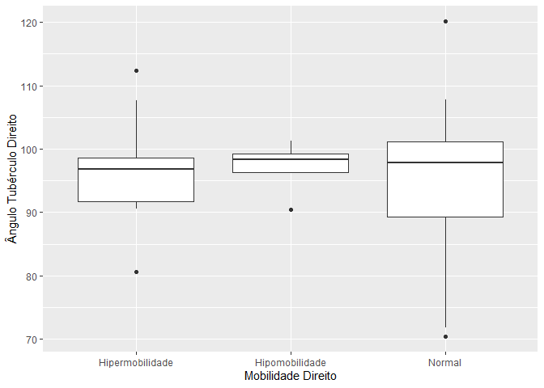<!-- -->

``` r
qplot(Pos.Disco.Dir, Angulo.Tub.Dir, geom="boxplot",
      xlab="Posição do Disco Direito", ylab="Ângulo Tubérculo Direito")
```

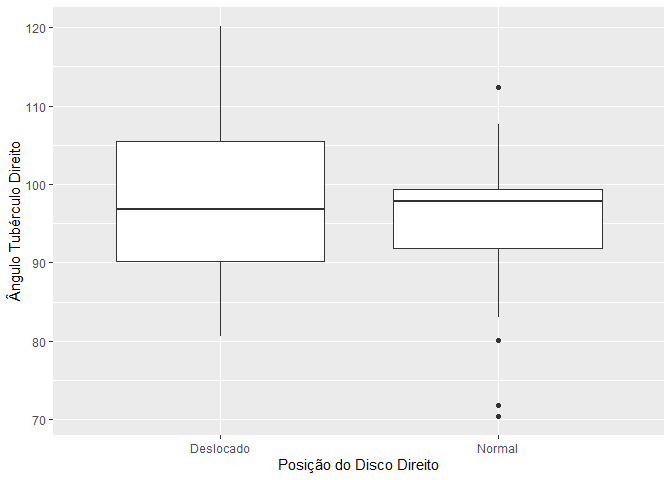<!-- -->

``` r
qplot(Fun.Disco.Dir, Angulo.Tub.Dir, geom="boxplot",
      xlab="Função do Disco Direito", ylab="Ângulo Tubérculo Direito")
```

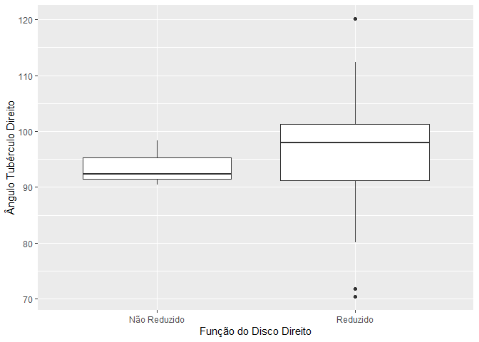<!-- -->

``` r
qplot(Mobilidade.Esquerdo, Angulo.Tub.Esq, geom="boxplot", 
      xlab="Mobilidade Esquerdo", ylab="Ângulo Tubérculo Esquerdo")
```

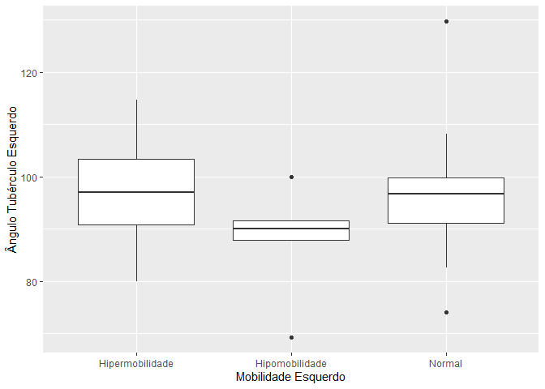<!-- -->

``` r
qplot(Pos.Disco.Esq, Angulo.Tub.Esq, geom="boxplot",
      xlab="Posição do Disco Esquerdo", ylab="Ângulo Tubérculo Esquerdo")
```

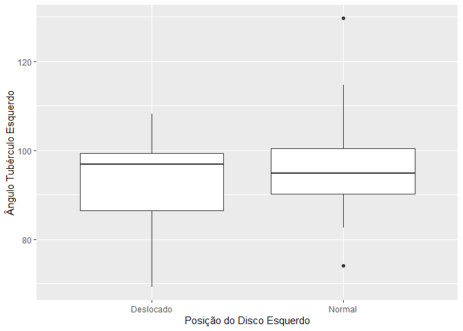<!-- -->

``` r
qplot(Func.Disco.Esq, Angulo.Tub.Esq, geom="boxplot",
      xlab="Função do Disco Esquerdo", ylab="Ângulo Tubérculo Esquerdo")
```

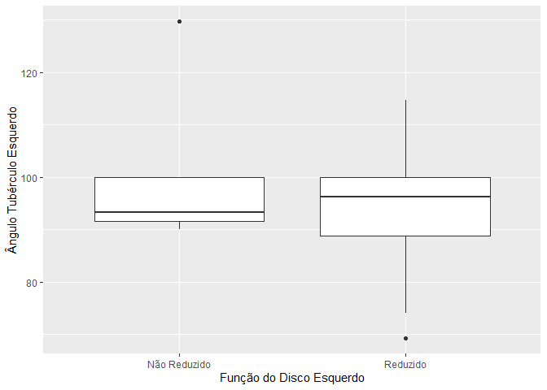<!-- -->

``` r
#Boxplots complexos
qplot(Mobilidade.Direito, Angulo.Tub.Dir, geom="boxplot", colour=Pos.Disco.Dir,
      xlab="Mobilidade Direito", ylab="Ângulo Tubérculo Direito")
```

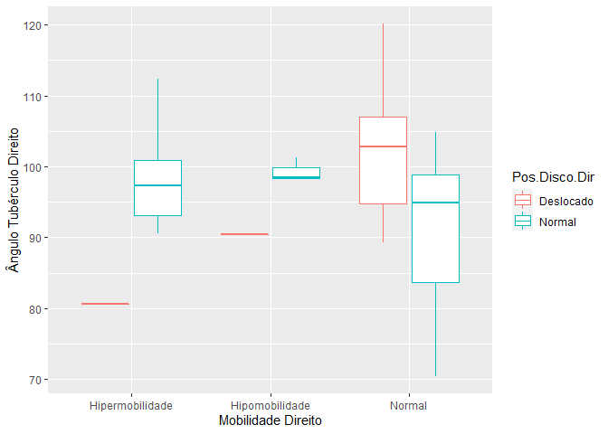<!-- -->

``` r
qplot(Pos.Disco.Dir, Angulo.Tub.Dir, geom="boxplot", colour=Mobilidade.Direito,
      xlab="Posição do Disco Direito", ylab="Ângulo Tubérculo Direito")
```

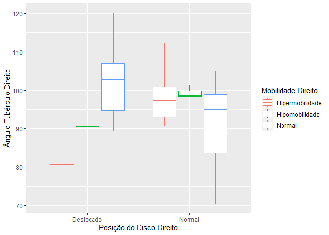<!-- -->

``` r
qplot(Mobilidade.Esquerdo, Angulo.Tub.Esq, geom="boxplot", colour=Pos.Disco.Esq,
      xlab="Mobilidade Esquerdo", ylab="Ângulo Tubérculo Esquerdo")
```

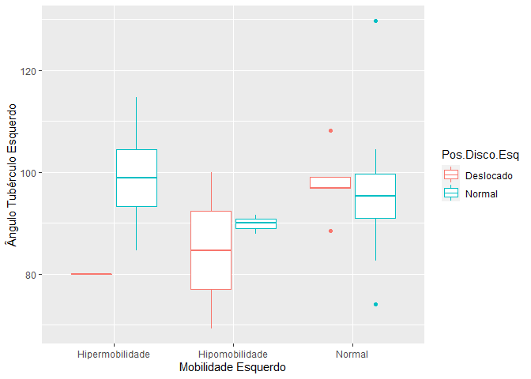<!-- -->

``` r
qplot(Pos.Disco.Esq, Angulo.Tub.Esq, geom="boxplot", colour=Mobilidade.Esquerdo,
      xlab="Posição do Disco Esquerdo", ylab="Ângulo Tubérculo Esquerdo")
```

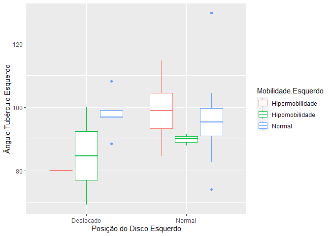<!-- -->

``` r
qplot(Angulo.Tub.Dir, geom="histogram",
      xlab="Ângulo do Tubérculo Direito", ylab="Número de amostras")
```

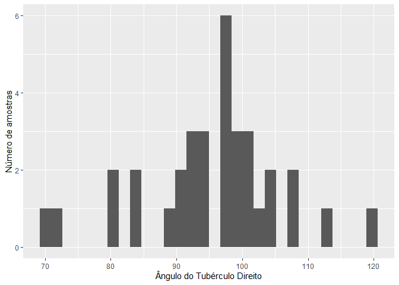<!-- -->

``` r
qplot(Angulo.Tub.Dir, geom="density",
      xlab="Ângulo do Tubérculo Direito", ylab="Número de amostras")
```

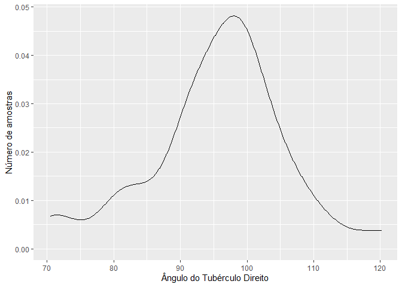<!-- -->

``` r
qplot(Angulo.Tub.Esq, geom="histogram",
      xlab="Ângulo do Tubérculo Esquerdo", ylab="Número de amostras")
```

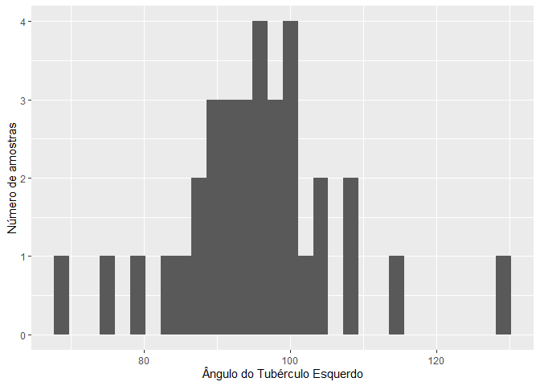<!-- -->

``` r
qplot(Angulo.Tub.Esq, geom="density",
      xlab="Ângulo do Tubérculo Esquerdo", ylab="Número de amostras")
```

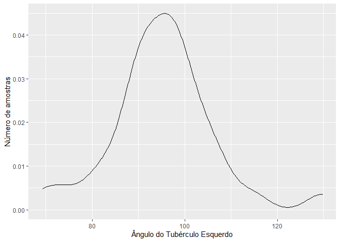<!-- -->

``` r
qplot(Volumetria.Direito, geom="histogram",
      xlab="Volumetria Direito", ylab="Número de amostras")
```

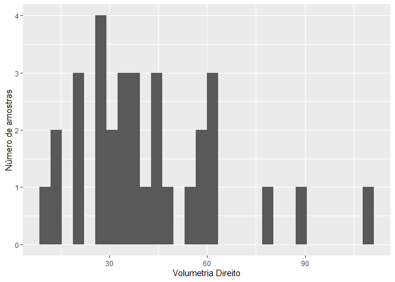<!-- -->

``` r
qplot(Volumetria.Direito, geom="density",
      xlab="Volumetria Direito", ylab="Número de amostras")
```

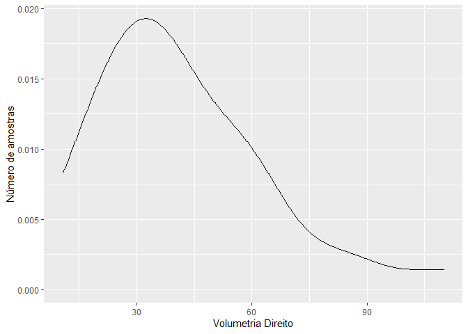<!-- -->

``` r
qplot(Volumetria.Esquerdo, geom="histogram",
      xlab="Volumetria Esquerdoo", ylab="Número de amostras")
```

<!-- -->

``` r
qplot(Volumetria.Esquerdo, geom="density",
      xlab="Volumetria Esquerdo", ylab="Número de amostras")
```

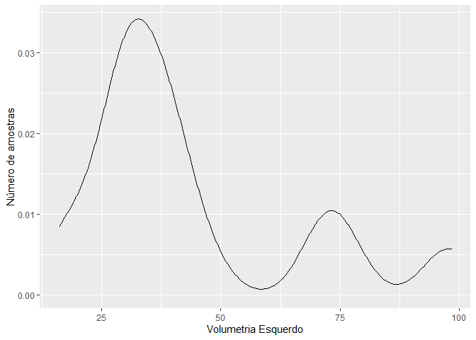<!-- -->

``` r
pairs(~Pos.Disco.Dir + Angulo.Tub.Dir + Volumetria.Direito)
```

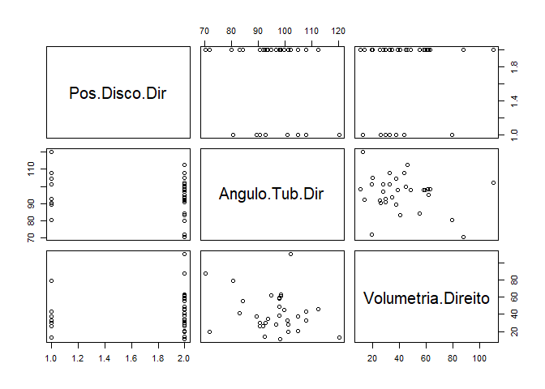<!-- -->

``` r
qplot(Angulo.Tub.Dir,Volumetria.Direito,
      xlab="Ângulo do Tubérculo Direito", ylab="Volumetria Direito")
```

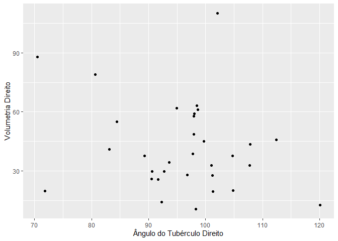<!-- -->

``` r
qplot(IDADE,Volumetria.Direito,
      xlab="Idade", ylab="Volumetria Direito")
```

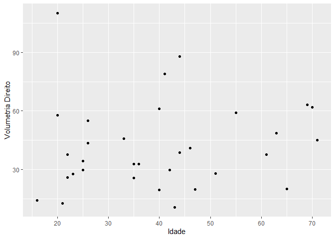<!-- -->

``` r
qplot(Angulo.Tub.Esq,Volumetria.Esquerdo,
      xlab="Ângulo do Tubérculo Esquerdo", ylab="Volumetria Esquerdo")
```

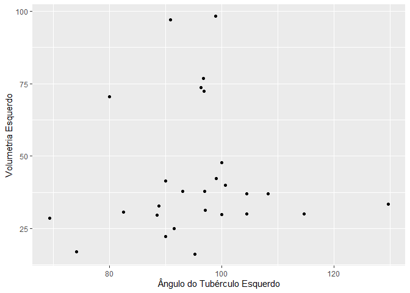<!-- -->

``` r
qplot(IDADE,Volumetria.Esquerdo,
      xlab="Idade", ylab="Volumetria Esquerdo")
```

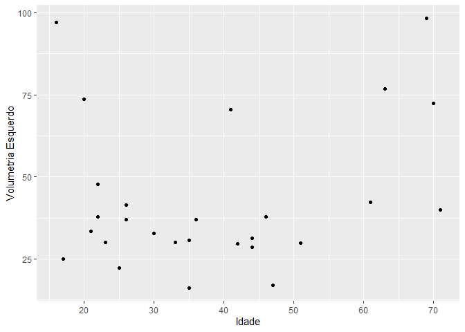<!-- -->

``` r
qplot(IDADE,Angulo.Tub.Dir,
      xlab="Idade", ylab="Ângulo do Tubérculo Direito")
```

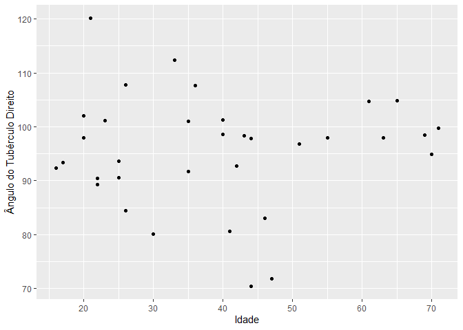<!-- -->

``` r
qplot(IDADE,Angulo.Tub.Esq,
      xlab="Idade", ylab="Ângulo do Tubérculo Esquerdo")
```

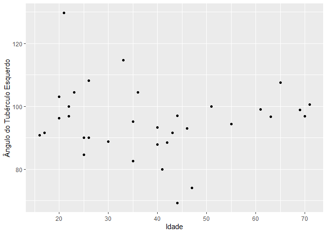<!-- -->

``` r
qplot(Angulo.Tub.Dir,Angulo.Tub.Esq,
      xlab="Ângulo do Tubérculo Direito",ylab="Ângulo do Tubérculo Esquerdo")
```

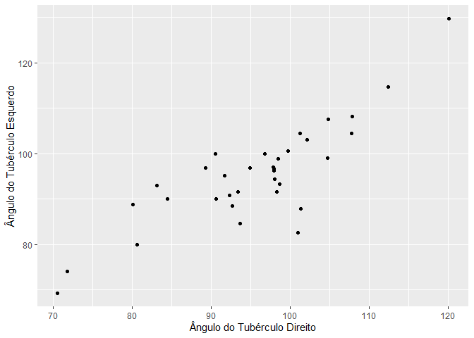<!-- -->

``` r
qplot(Volumetria.Direito,Volumetria.Esquerdo,
      xlab="Volumetria Direito",ylab="Volumetria Esquerdo")
```

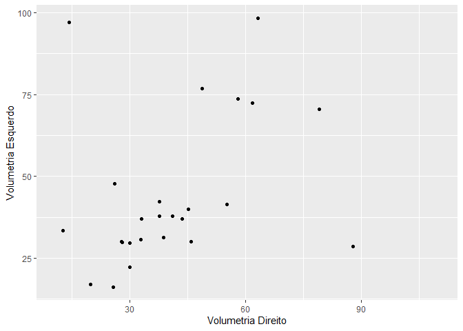<!-- -->

``` r
summary <- summary(Luis.TCC)
write.table(summary, file="TCCGu_summary.csv", row.names=F, sep=",")
summary
```

    ##                        NOME        IDADE       GENERO   Pos.Disco.Dir
    ##  ADRIANA MÁRCIA BORGES   : 1   Min.   :16.00   F:25   Deslocado: 8   
    ##  ANA LUIZA C F E SILVEIRA: 1   1st Qu.:25.00   M: 9   Normal   :26   
    ##  ANIBAL B L CASTRO       : 1   Median :38.00                         
    ##  CARMITA NUNES R SILVA   : 1   Mean   :38.94                         
    ##  CINTHYA A. C. PERSIANO  : 1   3rd Qu.:46.75                         
    ##  CRISTIANE A V MIRANDA   : 1   Max.   :71.00                         
    ##  (Other)                 :28                                         
    ##    Pos.Disco.Esq      Fun.Disco.Dir      Func.Disco.Esq
    ##  Deslocado: 8    Não Reduzido: 3    Não Reduzido: 5    
    ##  Normal   :26    Reduzido    :31    Reduzido    :29    
    ##                                                        
    ##                                                        
    ##                                                        
    ##                                                        
    ##                                                        
    ##        Mobilidade.Direito      Mobilidade.Esquerdo Angulo.Tub.Dir  
    ##  Hipermobilidade: 9       Hipermobilidade:10       Min.   : 70.50  
    ##  Hipomobilidade : 4       Hipomobilidade : 5       1st Qu.: 90.88  
    ##  Normal         :21       Normal         :19       Median : 97.85  
    ##                                                    Mean   : 95.47  
    ##                                                    3rd Qu.:101.15  
    ##                                                    Max.   :120.10  
    ##                                                                    
    ##  Angulo.Tub.Esq   Volumetria.Direito Volumetria.Esquerdo
    ##  Min.   : 69.30   Min.   : 10.81     Min.   :16.22      
    ##  1st Qu.: 90.00   1st Qu.: 27.36     1st Qu.:30.00      
    ##  Median : 95.75   Median : 37.59     Median :37.08      
    ##  Mean   : 95.27   Mean   : 41.80     Mean   :43.21      
    ##  3rd Qu.:100.00   3rd Qu.: 55.81     3rd Qu.:44.94      
    ##  Max.   :129.70   Max.   :110.00     Max.   :98.26      
    ##                   NA's   :2          NA's   :7

``` r
#Método de Spearman
cor.test(Angulo.Tub.Dir,Volumetria.Direito,method="spearman")
```

    ## 
    ##  Spearman's rank correlation rho
    ## 
    ## data:  Angulo.Tub.Dir and Volumetria.Direito
    ## S = 5984.1, p-value = 0.5982
    ## alternative hypothesis: true rho is not equal to 0
    ## sample estimates:
    ##         rho 
    ## -0.09680081

``` r
#Regressão Linear
lm.fit =lm(Angulo.Tub.Dir~Volumetria.Direito, data=Luis.TCC)
summary(lm.fit)
```

    ## 
    ## Call:
    ## lm(formula = Angulo.Tub.Dir ~ Volumetria.Direito, data = Luis.TCC)
    ## 
    ## Residuals:
    ##     Min      1Q  Median      3Q     Max 
    ## -26.512  -6.619   2.024   4.617  21.035 
    ## 
    ## Coefficients:
    ##                     Estimate Std. Error t value Pr(>|t|)    
    ## (Intercept)        100.38241    3.90448  25.710   <2e-16 ***
    ## Volumetria.Direito  -0.10439    0.08256  -1.264    0.216    
    ## ---
    ## Signif. codes:  0 '***' 0.001 '**' 0.01 '*' 0.05 '.' 0.1 ' ' 1
    ## 
    ## Residual standard error: 10.33 on 30 degrees of freedom
    ##   (2 observations deleted due to missingness)
    ## Multiple R-squared:  0.05059,    Adjusted R-squared:  0.01895 
    ## F-statistic: 1.599 on 1 and 30 DF,  p-value: 0.2158

``` r
summary(lm.fit)$r.sq #gives the R²
```

    ## [1] 0.05059494

``` r
summary(lm.fit)$sigma #Residual Squared Errors (RSE)
```

    ## [1] 10.32991

``` r
names(lm.fit)
```

    ##  [1] "coefficients"  "residuals"     "effects"       "rank"         
    ##  [5] "fitted.values" "assign"        "qr"            "df.residual"  
    ##  [9] "na.action"     "xlevels"       "call"          "terms"        
    ## [13] "model"

``` r
coef(lm.fit)
```

    ##        (Intercept) Volumetria.Direito 
    ##        100.3824082         -0.1043914

``` r
confint (lm.fit) #confidence intervals
```

    ##                        2.5 %       97.5 %
    ## (Intercept)        92.408400 108.35641601
    ## Volumetria.Direito -0.273004   0.06422118

``` r
plot(Angulo.Tub.Dir,Volumetria.Direito)
abline(lm.fit)
```

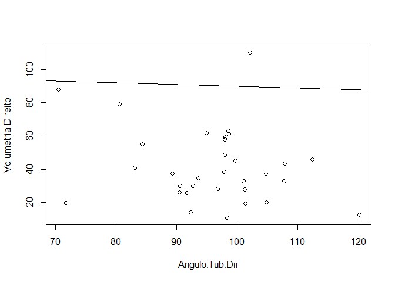<!-- -->

``` r
#Removendo outliers
outliers <- boxplot(Luis.TCC$Volumetria.Direito)$out # You can get the actual values of the outliers with this
```

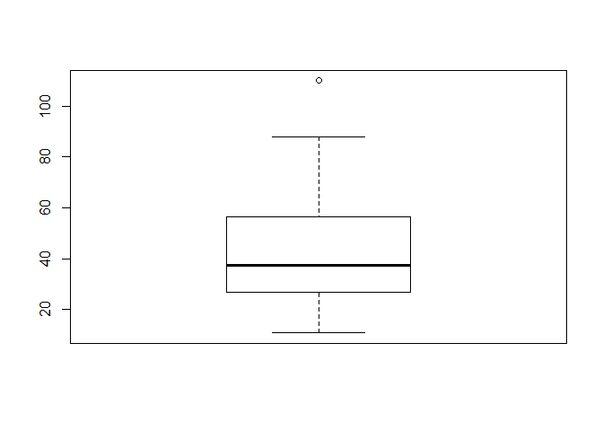<!-- -->

``` r
print(outliers)
```

    ## [1] 110

``` r
out <- Luis.TCC[-which(Luis.TCC$Volumetria.Direito %in% outliers),]
attach(out)
plot(Angulo.Tub.Dir,Volumetria.Direito)
```

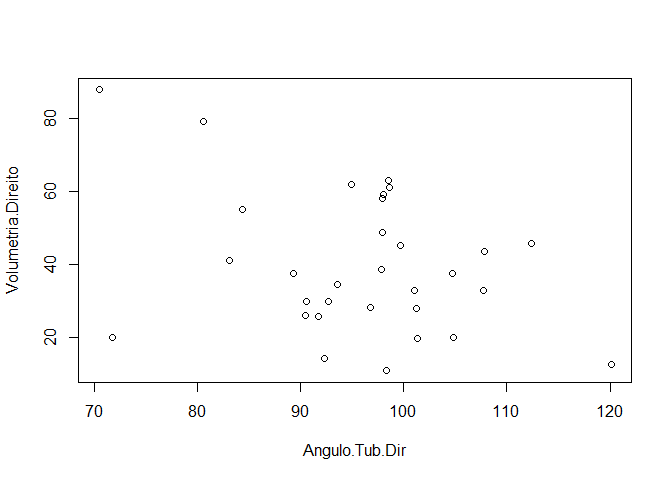<!-- -->

``` r
#Again...
lm.fit =lm(Angulo.Tub.Dir~Volumetria.Direito, data=out)
summary(lm.fit)
```

    ## 
    ## Call:
    ## lm(formula = Angulo.Tub.Dir ~ Volumetria.Direito, data = out)
    ## 
    ## Residuals:
    ##     Min      1Q  Median      3Q     Max 
    ## -27.779  -6.988   1.791   5.734  19.151 
    ## 
    ## Coefficients:
    ##                     Estimate Std. Error t value Pr(>|t|)    
    ## (Intercept)        103.34738    4.23434  24.407   <2e-16 ***
    ## Volumetria.Direito  -0.19002    0.09668  -1.965    0.059 .  
    ## ---
    ## Signif. codes:  0 '***' 0.001 '**' 0.01 '*' 0.05 '.' 0.1 ' ' 1
    ## 
    ## Residual standard error: 10.07 on 29 degrees of freedom
    ##   (2 observations deleted due to missingness)
    ## Multiple R-squared:  0.1176, Adjusted R-squared:  0.08712 
    ## F-statistic: 3.863 on 1 and 29 DF,  p-value: 0.059

``` r
summary(lm.fit)$r.sq #gives the R²
```

    ## [1] 0.1175509

``` r
summary(lm.fit)$sigma #Residual Squared Errors (RSE)
```

    ## [1] 10.07175

``` r
names(lm.fit)
```

    ##  [1] "coefficients"  "residuals"     "effects"       "rank"         
    ##  [5] "fitted.values" "assign"        "qr"            "df.residual"  
    ##  [9] "na.action"     "xlevels"       "call"          "terms"        
    ## [13] "model"

``` r
coef(lm.fit)
```

    ##        (Intercept) Volumetria.Direito 
    ##        103.3473769         -0.1900155

``` r
confint (lm.fit) #confidence intervals
```

    ##                         2.5 %       97.5 %
    ## (Intercept)        94.6871870 1.120076e+02
    ## Volumetria.Direito -0.3877415 7.710587e-03

``` r
plot(Angulo.Tub.Dir,Volumetria.Direito)
abline(lm.fit)
```

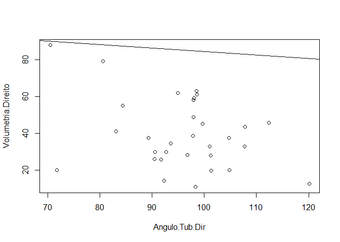<!-- -->
